1. ElasticSearch 구축
2. Fluentd 구축
3. Kibana 구축
<br/>
<br/>

# 0. EKS 구성 및 Nginx 실행

저번 포스트에서 비용 문제때문에 삭제하였던 EKS Cluster와 NodeGroup을 다시 생성한다.

```
$ eksctl create cluster --name mission-cluster --version 1.17 --region ap-northeast-2 --nodegroup-name mission-wn --node-type t3.medium --nodes 1 --nodes-min 1 --nodes-max 1 --ssh-access --ssh-public-key workernode-key --managed
```
<br/>

생성된 노드를 확인한다.

```
$ kubectl get node 
```
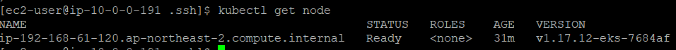

<br/>

Nginx 서비스를 배포하기 위해 우선 Nginx-Deployment.yaml 파일을 생성한 다음, Nginx 파드를 배포한다.

```
$ kubectl apply -f nginx-deployment.yaml
$ kubectl get pod				
```
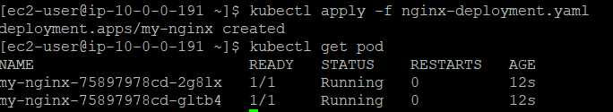

<br/>

다음 단계로, Nginx-Service.yaml 파일을 생성한 뒤, Nginx 서비스를 배포한다.

```
$ kubectl apply -f nginx-service.yaml		
$ kubectl get service	 	
```
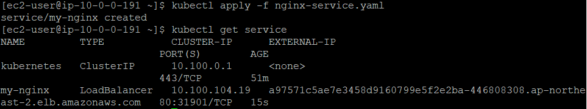

<br/>

로드 밸런서의 DNS를 통해 Nginx 서버 접속이 가능한지 확인한다.
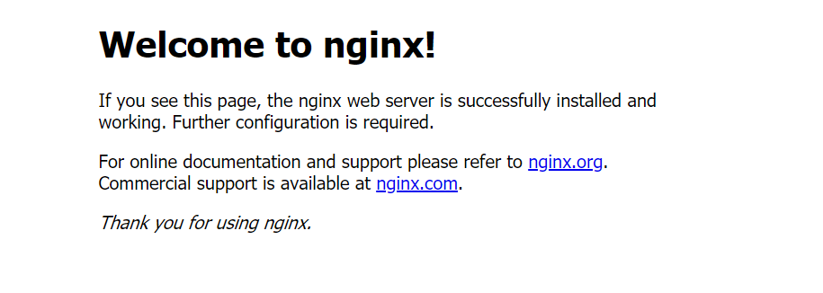
<br/>
<br/>
<br/>

# 1. ElasticSearch 구축

> elasticSearch 란 모든 유형의 데이터를 위한 분산형 오픈 소스 검색 및 분석 엔진으로, 많은 양의 데이터를 보관하고 실시간으로 분석하는 엔진이다.

쿠버네티스 환경에서는 elasticSearch.yaml 파일을 작성하여 elasticSearch를 배포할 수 있다.
먼저 elasticSearch.yaml 파일을 작성한다.

```
$ cat<<EOF > ~/elasticSearch.yaml
apiVersion: apps/v1
kind: Deployment
metadata:
  name: elasticsearch
  labels:
    app: elasticsearch
spec:
  replicas: 1
  selector:
    matchLabels:
      app: elasticsearch
  template:
    metadata:
      labels:
        app: elasticsearch
    spec:
      containers:
      - name: elasticsearch
        image: elastic/elasticsearch:6.4.0
        env:
        - name: discovery.type
          value: "single-node"
        ports:
        - containerPort: 9200
        - containerPort: 9300
        
---
apiVersion: v1
kind: Service
metadata:
  labels:
    app: elasticsearch
  name: elasticsearch-svc
  namespace: default
spec:
  ports:
  - name: elasticsearch-rest
    nodePort: 30920
    port: 9200
    protocol: TCP
    targetPort: 9200
  - name: elasticsearch-nodecom
    nodePort: 30930
    port: 9300
    protocol: TCP
    targetPort: 9300
  selector:
    app: elasticsearch
  type: NodePort
EOF
```
<br/>

elasticSearch.yaml파일로 NodePortType에 따라 elasticSearch를 배포한다.

```
$ kubectl apply -f elasticSearch.yaml	# 배포
$ kubectl get pod | grep elastic	# pod 확인
$ kubectl get svc | grep elastic	# service 확인
```

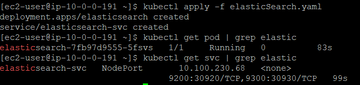
<br/> <br/>


> 리스너란 정의한 프로토콜과 포트를 사용하여 연결요청을 확인하는 프로세스다.
> 리스너에 정의한 규칙에 따라 로드밸런서가 등록된 대상으로 요청을 라우팅하는 방법을 결정한다.

LoadBalancer에 리스너를 추가하기 위해 elasticSearch.yaml파일에서 정의한 9200 포트를 로드밸런서의 리스너 탭에 추가한다. 
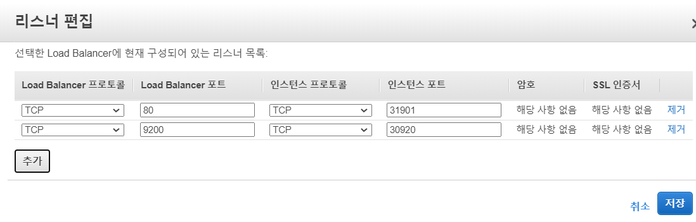
<br/>

또한, 로드밸런서의 9200번 포트로 외부 접근 허용을 위해 로드밸런서의 보안 그룹 인바운드 규칙을 편집해야 한다.
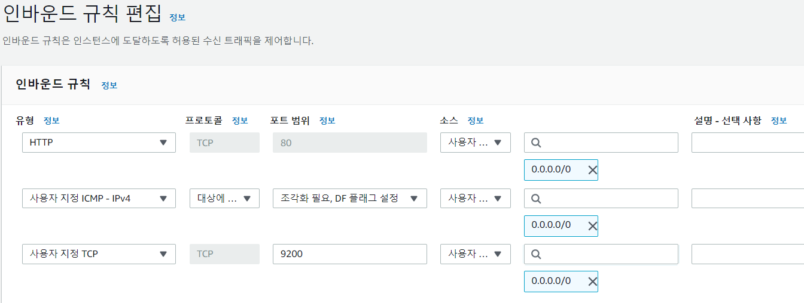
<br/>

모든 과정이 완료된다면 **로드밸런서DNS:9200** 접속을 통해 ElasticSearch를 NodePort type의 서비스로 배포하여 Nginx의 로드밸런서에 연결되어 통신이 이루어짐을 확인할 수 있다.

<br/>

<br/>


# 2. Fluentd 구축

> Fluentd는 로그 수집기로 다양한 데이터 소스(http, tcp 등)로부터 원하는 형태로 가공하여 목적지(s3, ElasticSearch)로 전달 가능하다.

fluentd.yaml 파일을 작성하여 fluentd를 배포할 수 있다. 먼저 fluentd.yaml 파일을 작성한다.

```
$ cat<<EOF > ~/fluentd.yaml
---
apiVersion: v1
kind: ServiceAccount
metadata:
  name: fluentd
  namespace: kube-system

---
apiVersion: rbac.authorization.k8s.io/v1beta1
kind: ClusterRole
metadata:
  name: fluentd
  namespace: kube-system
rules:
- apiGroups:
  - ""
  resources:
  - pods
  - namespaces
  verbs:
  - get
  - list
  - watch

---
kind: ClusterRoleBinding
apiVersion: rbac.authorization.k8s.io/v1beta1
metadata:
  name: fluentd
roleRef:
  kind: ClusterRole
  name: fluentd
  apiGroup: rbac.authorization.k8s.io
subjects:
- kind: ServiceAccount
  name: fluentd
  namespace: kube-system

---
apiVersion: apps/v1
kind: DaemonSet
metadata:
  name: fluentd
  namespace: kube-system
  labels:
    k8s-app: fluentd-logging
    version: v1
    kubernetes.io/cluster-service: "true"
spec:
  selector:
    matchLabels:
      k8s-app: fluentd-logging
      version: v1
  template:
    metadata:
      labels:
        k8s-app: fluentd-logging
        version: v1
        kubernetes.io/cluster-service: "true"
    spec:
      serviceAccount: fluentd
      serviceAccountName: fluentd
      tolerations:
      - key: node-role.kubernetes.io/master
        effect: NoSchedule
      containers:
      - name: fluentd
        image: fluent/fluentd-kubernetes-daemonset:v1.4.2-debian-elasticsearch-1.1
        env:
          - name:  FLUENT_ELASTICSEARCH_HOST
            value: "elasticsearch-svc.default.svc.cluster.local"
          - name:  FLUENT_ELASTICSEARCH_PORT
            value: "9200"
          - name: FLUENT_ELASTICSEARCH_SCHEME
            value: "http"
        resources:
          limits:
            memory: 200Mi
          requests:
            cpu: 100m
            memory: 200Mi
        volumeMounts:
        - name: varlog
          mountPath: /var/log
        - name: varlibdockercontainers
          mountPath: /var/lib/docker/containers
          readOnly: true
      terminationGracePeriodSeconds: 30
      volumes:
      - name: varlog
        hostPath:
          path: /var/log
      - name: varlibdockercontainers
        hostPath:
          path: /var/lib/docker/containers
EOF
```
<br/>

fluentd.yaml 파일로 fluentd Daemonset pod를 배포한 후 서비스가 배포되었는지 확인한다.
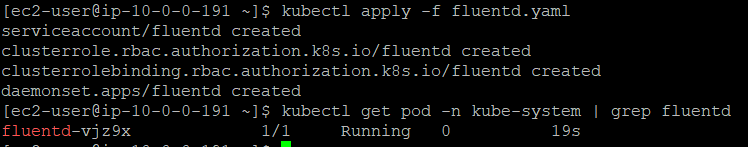
<br/>

아래의 kibana 구축 단계를 거쳤다면 kibana에서 로그를 수집할 인덱스 패턴을 생성할 수 있다. 
(먼저 kibana 구축 끝내고 이번 단계 진행)

- 인덱스 패턴 생성 : kibana -> [management] -> [index patterns] -> Index Pattern: logstash* -> next step -> @timestamp -> create index pattern
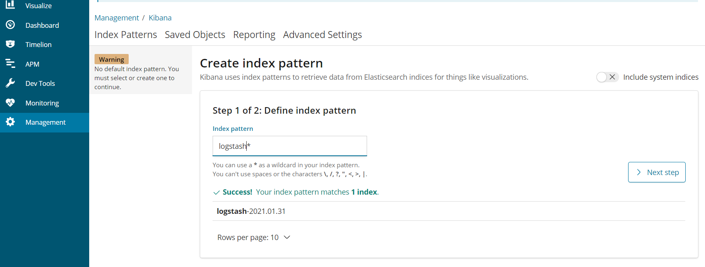

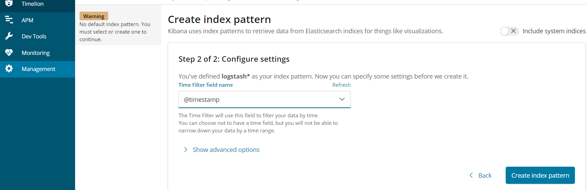
<br/>

로그 시각화 마지막 단계이다. 검색 필터를 설정하여 nginx의 로그를 확인할 예정이다.
kibana -> [discover] -> 검색필터 설정 -> kubernetes.labels.run is [nginx 배포 시 사용한 label]
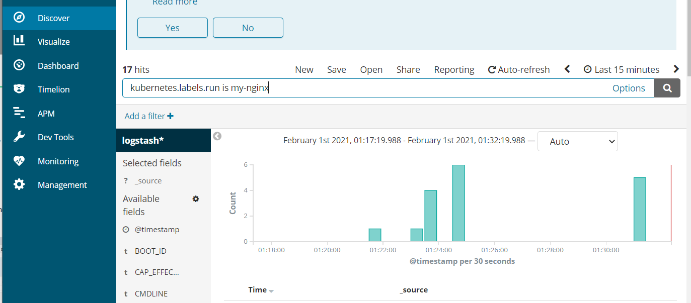
<br/>
<br/> 
<br/>

# 3. Kibana 구축

> kibana는 오픈 소스 기반의 분석 및 시각화 플랫폼이다. Elastic stack을 기반으로 구축된 오픈 소스 프론트엔드 애플리케이션으로 ElasticSearch에서 색인된 데이터를 검색하고 시각화하는 기능을 제공한다.

kibana.yaml 파일을 작성하여 kibana를 배포할 수 있다. 먼저 kibana.yaml 파일을 작성한다.

```
$ cat<<EOF > ~/kibana.yaml
apiVersion: apps/v1
kind: Deployment
metadata:
  name: kibana
  labels:
    app: kibana
spec:
  replicas: 1
  selector:
    matchLabels:
      app: kibana
  template:
    metadata:
      labels:
        app: kibana
    spec:
      containers:
      - name: kibana
        image: elastic/kibana:6.4.0
        env:
        - name: SERVER_NAME
          value: "kibana.kubenetes.example.com"
        - name: ELASTICSEARCH_URL
          value: "http://elasticsearch-svc.default.svc.cluster.local:9200"
        ports:
        - containerPort: 5601

---
apiVersion: v1
kind: Service
metadata:
  labels:
    app: kibana
  name: kibana-svc
  namespace: default
spec:
  ports:
  - nodePort: 30561
    port: 5601
    protocol: TCP
    targetPort: 5601
  selector:
    app: kibana
  type: NodePort
EOF
```
<br/>

작성한 kibana.yaml로 NodePortType의 서비스로 kibana를 배포한다. 
```
$ kubectl apply -f kibana.yaml	# 배포
$ kubectl get pod	# pod 확인
$ kubectl get service	# 서비스 확인
```

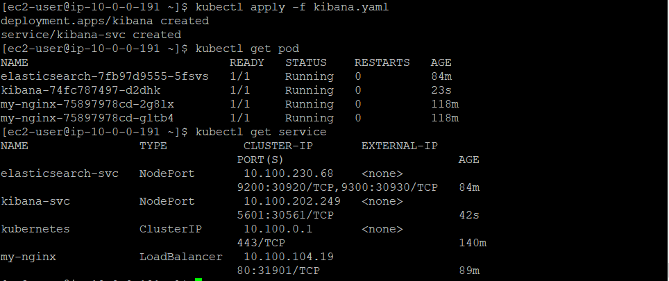
<br/>

LoadBalancer에 리스너를 추가하기 위해 kibana.yaml파일에서 정의한 5601포트를 로드밸런서의 리스너 탭에 추가한다. 
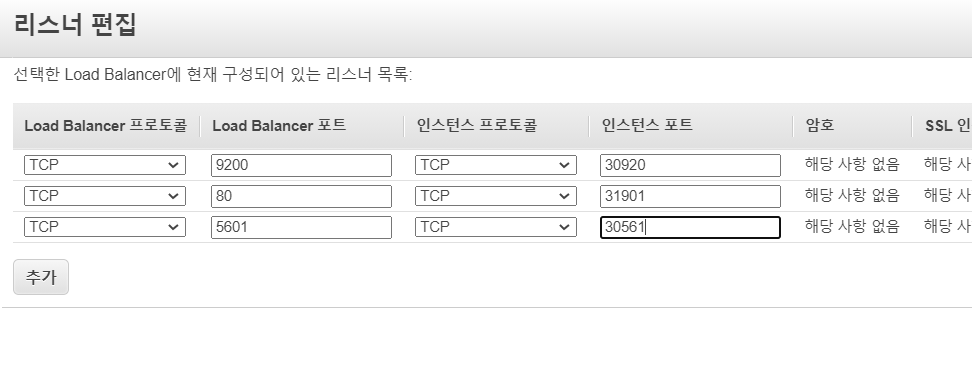
<br/>

또한, 로드밸런서의 5601번 포트로 외부 접근 허용을 위해 로드밸런서의 보안 그룹 인바운드 규칙을 편집해야 한다.
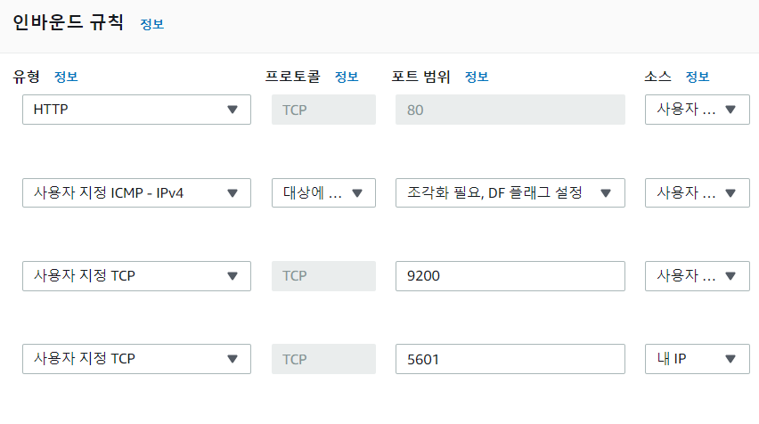
<br/>

모든 과정이 완료된다면 **로드밸런서DNS:5601** 접속을 통해 kibana를 NodePort type의 서비스로 배포하여 Nginx의 로드밸런서에 연결되어 통신이 이루어짐을 확인할 수 있다.

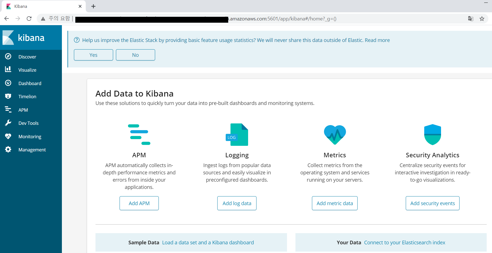

<br/>

<br/>


# 4. 자원 삭제

1. kubernetes 자원 삭제

```
$ kubectl delete -f elasticSearch.yaml
$ kubectl delete -f kibana.yaml
$ kubectl delete -f fluentd.yaml
$ kubectl delete -f nginx-service.yaml
$ kubectl delete -f nginx-deployment.yaml
```

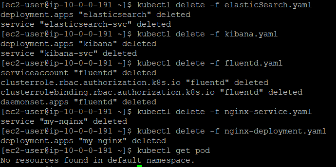
<br/>

2. EKS 클러스터와 Node Group을 삭제한다.

- 콘솔에서 eks cluster와 nodegroup이 삭제되었는지 확인한다.

```
$ eksctl delete cluster --region ap-northeast-2 --name=mission-cluster
```

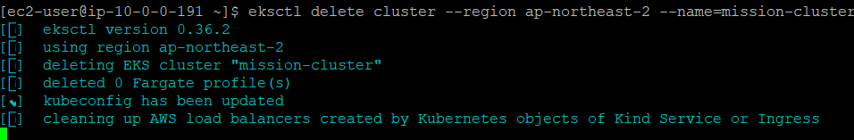

